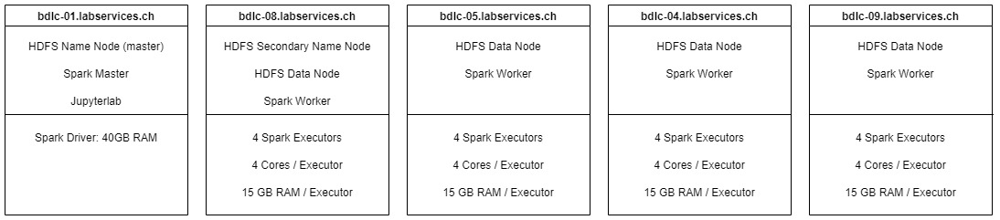

# Group 2 - Analyse parking violations in NYC

## Table of Contents
- [Abstract](#abstract)
- [Cluster](#cluster)
- [Dataset](#dataset)
- [Prototyping - Preprocessing - Dataflow](#prototyping--preprocessing--dataflow)
- [Analysis](#analysis)
- [Learnings](#learnings)

## Abstract

TBD

## Cluster

### Nodes

| Machine                 | Role    |
| ----------------------- | ------- |
| bdlc-01.labservices.ch  | Master  |
| bdlc-08.labservices.ch  | Secondary Name Node / Worker  |
| bdlc-04.labservices.ch  | Worker  |
| bdlc-05.labservices.ch  | Worker  |
| bdlc-09.labservices.ch  | Worker  |

### Tech Stack

We use the following technologies:
- HDFS to store all the data
- Spark (with Pyspark) in standalone mode to proccess all the data
- Jupyterlab for coding and code execution
- Git with github for code versioning and collaboration

### Resources

Distribution of resources:

Total resources:

- 16 Spark Executors
- 64 Cores
- 60 GB RAM

### Webservices

[HDFS](http://bdlc-01.labservices.ch:9870/dfshealth.html#tab-overview)

[SPARK](http://bdlc-01.labservices.ch:8080/)

[SPARK HISTORYSERVER](http://bdlc-01.labservices.ch:18080/)

[JUPYTERLAB](http://bdlc-01.labservices.ch:8888/lab) with password `123456*`

## Dataset

See [Data](../src/1_Data/Prepare_Data.ipynb)

## Prototyping - Preprocessing - Dataflow 

See [Preprocessing](../src/2_Preprocessing/CSV%20to%20Parquet.ipynb)

## Analysis

See [Analysis](../src/3_Analysis/Queries.ipynb)

## Learnings

TBD
